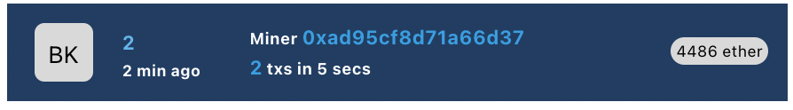
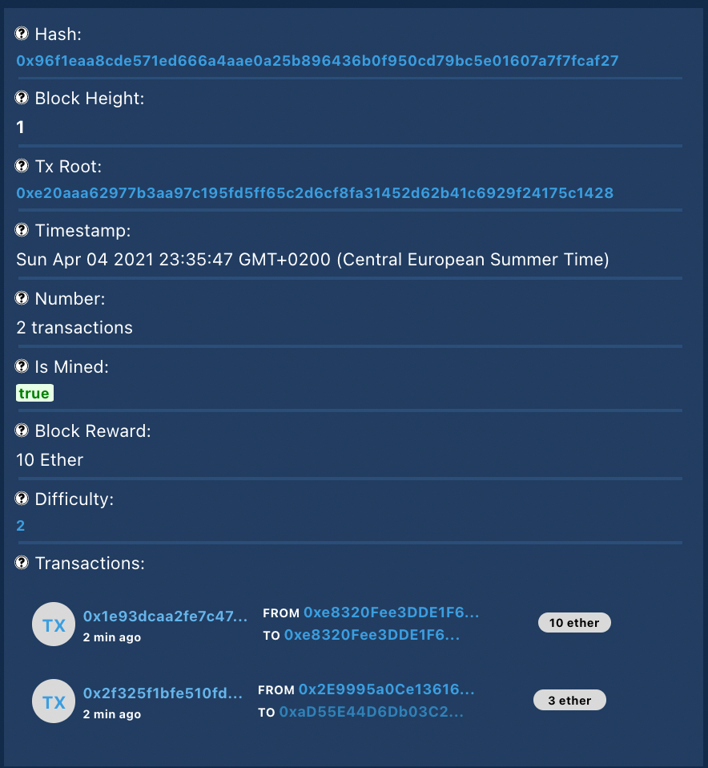
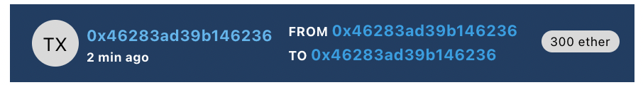
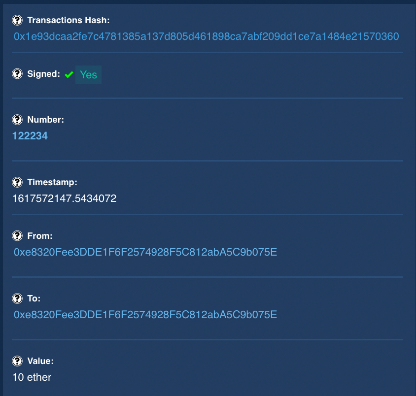

# Block Explorer

> Design inspired by [etherscan.io](https://etherscan.io/)

Explore the blockchain that you can build yourself [from-scratch](https://github.com/SharifElfouly/blockchain-from-scratch/).

Simple react components for looking at blocks and their transactions.

#### Block

##### Details

#### Transaction

##### Transaction Details

